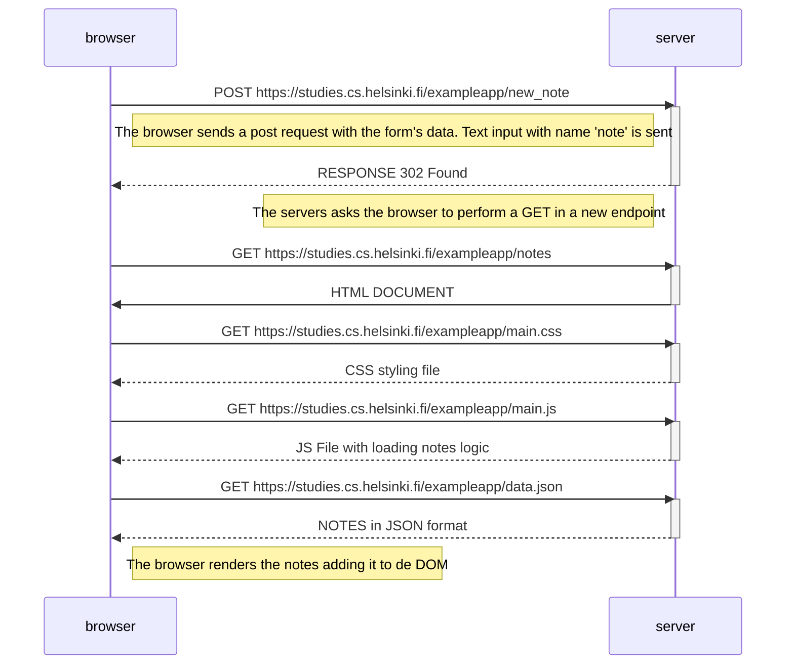

```mermaid
sequenceDiagram
    participant browser
    participant server

    browser->>server: POST https://studies.cs.helsinki.fi/exampleapp/new_note
    activate server
    Note right of browser: The browser sends a post request with the form's data. Text input with name 'note' is sent
    server-->>browser: RESPONSE 302 Found
    deactivate server
    Note left of server: The servers asks the browser to perform a GET in a new endpoint

    browser->>server: GET https://studies.cs.helsinki.fi/exampleapp/notes
    activate server
    server->>browser: HTML DOCUMENT
    deactivate server

    browser->>server: GET https://studies.cs.helsinki.fi/exampleapp/main.css
    activate server
    server-->>browser: CSS styling file
    deactivate server

    browser->>server: GET https://studies.cs.helsinki.fi/exampleapp/main.js
    activate server
    server-->>browser: JS File with loading notes logic
    deactivate server

    browser->>server: GET https://studies.cs.helsinki.fi/exampleapp/data.json
    activate server
    server-->>browser: NOTES in JSON format
    deactivate server

    Note right of browser: The browser renders the notes adding it to de DOM
```
